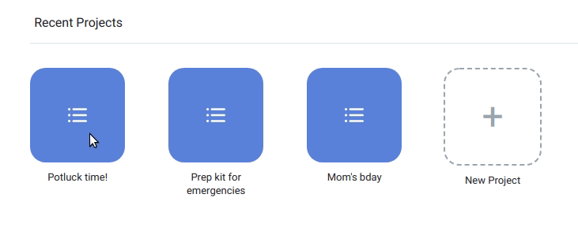
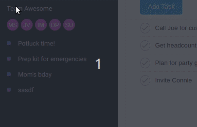
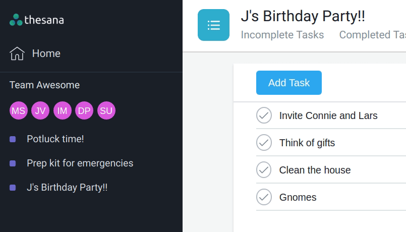
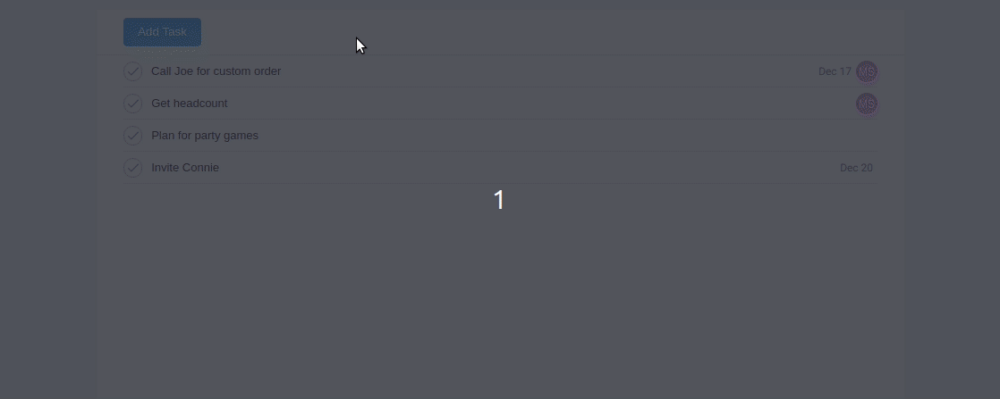
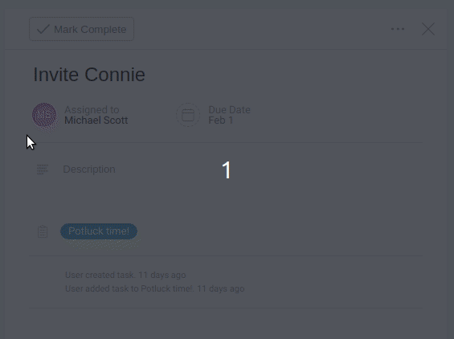

# Thesana 

Thesana, an Asana clone, is a web application designed to help teams organize, track, and manage their work. Teams members can create projects and tasks. Members can assign tasks to team members, set a due date, and mark tasks as complete or incomplete.

[Thesana Live Demo](https://thesana.herokuapp.com/#/)

## Features 

In Thesana, users can create, view, edit, and delete projects through the home screen and dropdown menus of individual projects. 

Projects and tasks are accessible to the entire team.

Users can edit tasks within the project task page, including assigning team members to tasks, setting a due date, and marking the task as complete. 

